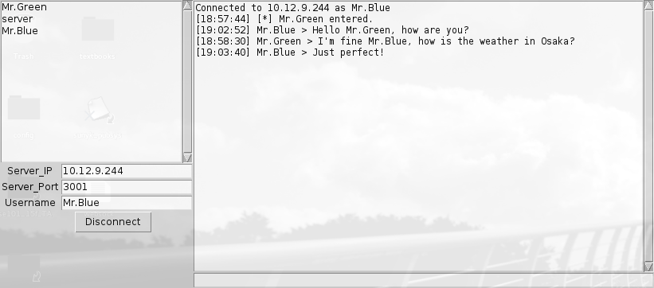

> CSE534 Assignment 2
> SUNY Korea (Fall 2015)
> Delvison Castillo (delvison.castillo@sunykorea.edu)


## Introduction
This application is meant to allow users using the client application to connect
to a server and exchange messages. Essentially, it is meant to create a chatroom
that is hosted by a server. The chatroom has the following requirements:

- Each username in the chatroom must be unique.
- The server can force the disconnection of a client.
- The client can request disconnection from the server.
- The server must monitor the connection statuses of all connected clients.
- All messages sent to the server by a client must be propagated to all other
clients.

## Server Module
The server module is implemented in the *chat_server.py* module. This
implementation does not utilize a GUI and is completely run in the Command Line
Interface (CLI). Initially, the server creates a socket bounded to a given port
number and stores its instance in a hash global variable that associates a
username with a socket object. The list of sockets as well as other global
variables can be viewed below:

```
HOST = socket.gethostbyname(socket.gethostname()) # current machine's hostname
SOCKET_LIST = {} # dictionary of sockets and users = {username:socket,...}
RECV_BUFR = 4096 # buffer size for messages
PORT = 3001 # port of server being connected to
STAR = "[*] " # event marker -- tells when a person enters or leaves room
DEBUG = False # debugger flag
COMMANDS = ["HELP","KICK","LIST_USERS","EXIT"] # list of available commands
```

The program entires a while loop and simply adds newly connected users to the
*SOCKET_LIST* variable.

The server module can be executed by the following command:

```
python3 chat_server.py
```

### Handling New Connections and stdin
New connections as well as input into stdin is handled using python's built-in
select module. The select module is a direct interface to the underlying
operating system implementation that allows it to monitor sockets, open files,
and pipes until they become readable or writable. Below is an example of how
select was used in this server implementation.

```
while 1:
	ready_to_read,ready_to_write,in_error =
	select.select(all_sockets,[],[],0)
	for sock in ready_to_read:
		# a new connection request is received
		if sock == server_socket:
			...
		# sending a message
		elif sock == sys.stdin:
			...
		# a message from a client is received
		else:
			...
```

### Handling Disconnections and Monitoring Connection Status
Disconnections are also handled by python's _select_ module as a client who
disconnects sends a TCP packet with the FIN bit set to 1. _Select_ detects a new
message in the socket and interprets it as a disconnected user. The news about
the disconnected user is then broadcasted to the rest of the clients in the
chat. In addition, on detection of a timeout, the server removes the
corresponding user like so:

```
def recv_msg(server_socket, sock):
	"""
  Recieves a message from the given socket.
  """
  # receive message
  try:
		...

  except(UnboundLocalError):
      print("ERROR: Attempted to send to user that doesnt exist.")

  except(ConnectionResetError,NameError, socket.timeout) as e:
      msg = STAR+username+" exited."
      print("\n"+msg)
      send_msg_to_all(server_socket, sock, username, msg)
```

### Sending Messages to All Clients
Connected clients are stored in a dictionary global variable. When the server
wants to send a message to all its clients, it simply iterates through the data
structure like so:

```
def send_msg_to_all(server_socket, senders_socket,senders_username, message):
    """
    Sends a message to all other connected clients.
    """
    message = "["+datetime.now().strftime('%H:%M:%S')+"] "+message
    for username, socket in SOCKET_LIST.items():
        if socket != server_socket and socket != senders_socket:
            try:
                # attempt to send message to client
                socket.send(bytes(message,'UTF-8'))
            except:
                # close socket if message fails
                socket.close()
                # remove client from the sockets list
                remove_user(username)
    # print out prompt message
    prompt()
```

Here we can see that the server removes any client that they are not able to
reach upon sending a message.

### Distinguishing Special Events
It is clear that in this chatroom setting it is important to distinguish regular
messages from events such as when a user enters or leaves the chat. The server
distinguishes these messages by appending the \[\*\] special string to the
start of a message. The clients then cautiously examine the messages containing
this special string to decide whether an event has occurred or not.

### Kicking User's Out
In addition to being able to send messages the server module also supports the 4
following commands HELP, KICK, LIST_USERS, and EXIT. In order to kick a given
user out one must type KICK followed by the name of the user. This action can be
viewed below from the perspective of the host.

```
##################################################################
Chat running 10.12.9.244:3001
##################################################################

[21:11:34] Host >

[*] Spider-Man entered.

USERS: [Host,Spider-Man]
[21:12:28] Host >

[*] Ironman entered.

USERS: [Ironman,Host,Spider-Man]
[21:12:35] Host >
[21:12:52] Spider-Man > Hey Ironman, what's up?
[21:12:52] Host >
[21:14:04] Ironman > Not much, just getting ready to reveal your identity
as Peter Parker to the rest of the world!
[21:14:04] Host > KICK Ironman

[*] Ironman has been kicked out.

USERS: [Host,Spider-Man]
[21:14:26] Host >
```

## Client Module
The client module was implemented in the *chat_client.py* module. This
implementation can be executed in either GUI or CLI environments. The commands
to run the client in CLI or GUI mode are:
```
python chat_client.py -c        #cli mode
python chat_client.py           #gui mode
```


 The GUI
contains input fields for a server's IP and port as well as a desired username.
The client will attempt to connect to the server upon clicking connect. If the
server already has a client connected with a given username then it will send a
NACK to the client disallowing it a connection. Once connected, the user can
send messages to the server by typing them in the textbox towards the bottom and
hitting the enter key. Connected users can be viewed in a list off to the left.
A screenshot of the GUI can be seen below.



The GUI runs on the main thread. Upon a successful connection, a new thread is
spawned to handle all socket interactions with a reference of the GUI passed
so that the thread can update it accordingly.

### Adding and Removing Users
The server marks special events such as a new user entering or a user exiting by
appending the special string \[\*\] at the beginning of a message. The client
application simply filters for these special strings to determine if it should
add or remove a user to it's user list. This process can be seen below.

```
def recv_msg(gui,socket):
    """
    Allows the program to recieve a message on the given socket. Takes in the
    GUI object and the active socket connected to the server. This function is
    also responsible for adding users into the chatroom in the GUI.
    """
    data = socket.recv(RECV_BUFR)
    if not data :
        gui.disconnect()
    else:
        # decode newly received message
        data = data.decode()
        # gui.chat.insert(END,"\n"+data)
        gui.display("\n"+data)

        # a new user has entered. Add to the GUI
        if "[*]" in data and "entered" in data and len(data.strip()) >= 1:
            gui.add_user(data.split(" ")[-2])

        # a user has left. Remove from the GUI
        if "[*]" in data and "exited" in data:
            gui.remove_user(data.split(" ")[-2])
```

### Sending Messages
Sending messages in this implementation requires little explanation as it is
mostly self explanatory. The textbox in the gui where the user types a message
is bound to a listener that executes the send message function when it detects
that the return key has been hit. The send message function is as simple as:

```
def send_msg(server_socket,msg):
  """
  Allows a user to send a message to the chat server using the given socket.
  """
  server_socket.send(bytes(msg,'UTF-8'))
```

It is worth noting that strings must be encoding as bytes in UTF-8 format to be
sent over socket.

### Disconnecting From the Server
In order to disconnect from the server and leave the chat, a user need only
click the disconnect button. This action results in the program closing the
socket and removing all users from the user list in the GUI.


## Troubles with websockets
It was originally planned for this application to also support web-based clients
who could connect via the browser. Since HTTP is a protocol that can only
deliver static web pages from a server to a client, an additional protocol
has to be used in order to maintain a constant open connection between the
client and server. The most widely used protocol for doing so is one called
websockets. The issue with websockets is that it requires a special handshake to
initiate a connection. An example of the  handshake initiated by the client to
the server can be seen below.

```
GET /chat HTTP/1.1
Host: example.com:8000
Upgrade: websocket
Connection: Upgrade
Sec-WebSocket-Key: dGhlIHNhbXBsZSBub25jZQ==
Sec-WebSocket-Version: 13
```

The most important field in this message is the *Sec-WebSocket-Key* field that
holds a unique key which the server must read, concatenate the special string
258EAFA5-E914-47DA-95CA-C5AB0DC85B11 to, SHA-1 hash the result, and finally
return the base64 encoding of the hash. This process was written in the
following function:

```
def websock_handshake (client, data):
  """
  Performs a standard websocket handshake.
  """
  key = (re.search('Sec-WebSocket-Key:\s+(.*?)[\n\r]+', data).groups()[0].strip())
  shake = "HTTP/1.1 101 Switching Protocols\r\n"
  shake += "Upgrade: websocket\r\n"
  shake += "Connection: Upgrade\r\n"
  shake += "Sec-WebSocket-Accept: %s \r\n\r\n" % sha1_handshake_key(key)
  return client.send(bytes(shake,'UTF-8'))
```
This worked successfully with the implemented python server and a php client
implementation using websockets. Yet, it is important to note that message
exchanges in the websocket protocol also require special formatting. Failure
to correctly produce the websocket message format prevented the successful
implementation of a web-based client. The easiest way to have fixed this would
be to scrap the python server that was written and re-implement a server using
a language with built-in support such as php.


## Dependencies

In order to run this application in GUI mode, ensure that python's tkinter
module is installed on your machine. In the arch-linux computer used to develop
this application this was done with the following command:

		pacman -S tk
